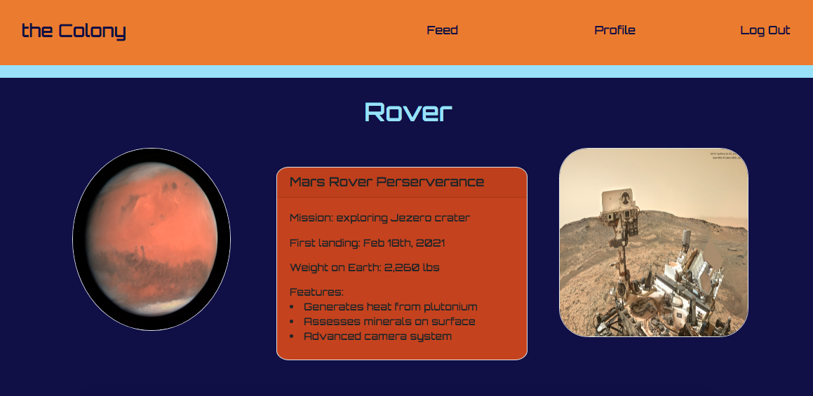
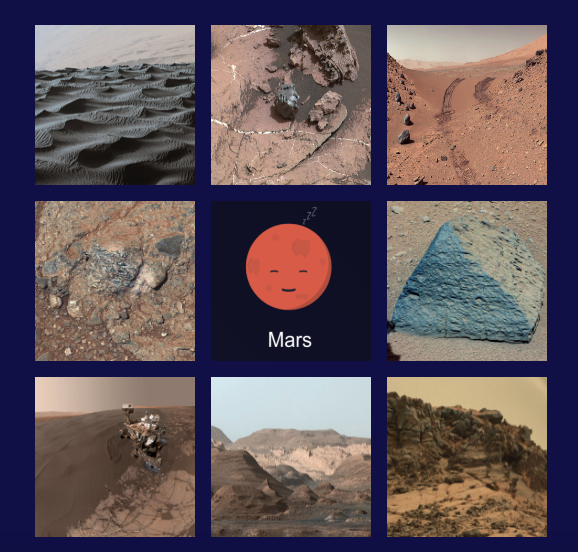

# the-colony
uses React and Mongo to view Mars info, develop a profile, and post to the Colony's feed

## Table of Contents

  - [Description](#description)
  - [Technologies](#technologies)
  - [Deployment](#deployment)
  - [License](#license)
  - [Contact](#contact)
  - [Screenshots](#screenshots)

  ## Description

  The Colony is a PC and mobile app designed to function as a placeholder.
  
  ## Technologies:

  * Front-end: React/Jsx, HTML, CSS, Js
  * Back-end: mongoose, MongoDB, Robo 3T, express
  * Dev-deps: nodemon, Chrome's dev tools

  ## Deployment:

  Check out the app on Heroku:

  ## License
  
  
  
  ## Contact

  * If you have any questions/concerns regarding the app, please reach out to our GitHub profiles: brettfleming, Chaoly123, CortlandSB, goreno41, tedheikkila

## Screenshots

* home

    

* log in/sign up

    
