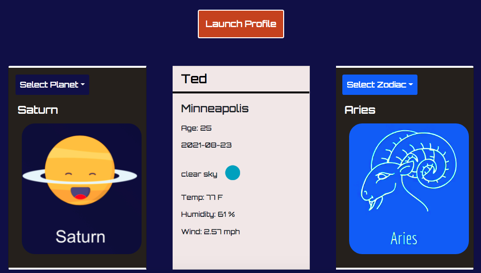
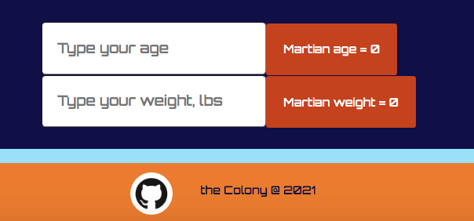
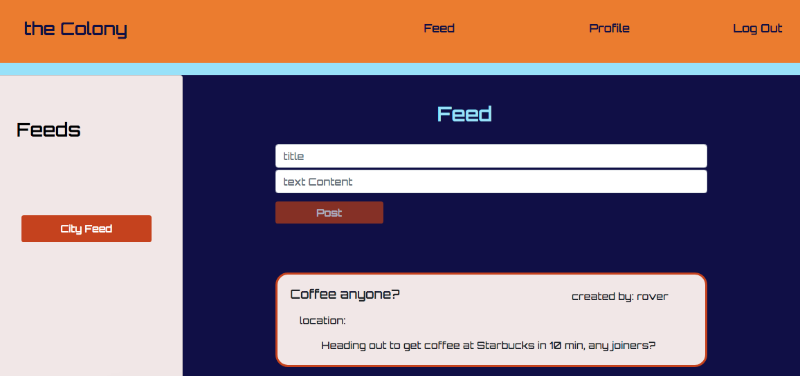
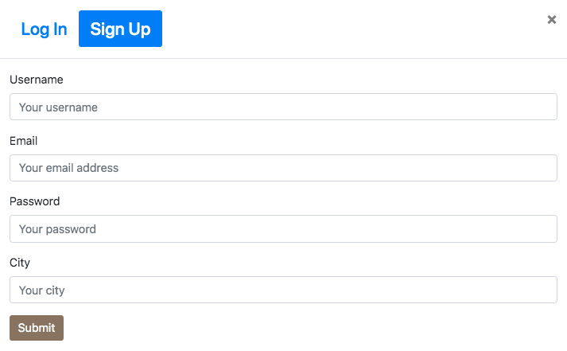
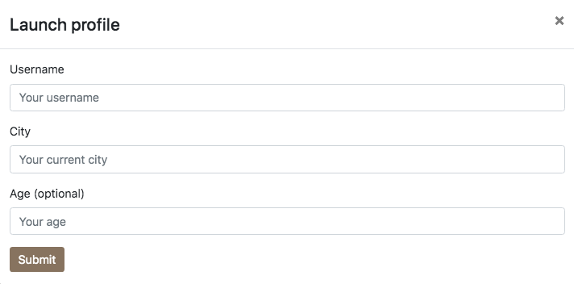

# the-colony
uses React and Mongo to view Mars info, develop a profile, and post to the Colony's feed

### Dev Team:
Brett F. Josh R. Cortland S-B, Chao L., Ted H.

## Table of Contents

  - [Description](#description)
  - [Technologies](#technologies)
  - [Deployment](#deployment)
  - [License](#license)
  - [Contact](#contact)
  - [Screenshots](#screenshots)

  ## Description

  The Colony is a PC and mobile app designed to function as a NASA and space inspired social platform. Here a user can view current Mars Rover info, develop their own profile (planet/zodiac selection, city's weather, and their Mars age/weight), and post to the Colony's feed. The app's main intent is to enable users to experience their city's activity (people, places, and events) via the Feed page.
  
  ## Technologies:

  ### MERN tech stack
  * Front-end: React/Jsx, HTML, CSS, Bootstrap, Js, localStorage
  * Back-end: Mongoose, MongoDB, Robo 3T, Atlas, express, dotenv (REST)
  * Dev-deps: nodemon, React error messaging, Chrome's dev tools

  ## Deployment:

  Check out the app on Heroku:

  ## License
  
  
  
  ## Contact

  * If you have any questions/concerns regarding the app, please reach out to our GitHub profiles: brettfleming, Chaoly123, CortlandSB, goreno41, tedheikkila

## Screenshots

* home page (top)

    

* home page (bottom)

    

* profile page (user info)

    

* profile page (Mars calculator)

    

* feed page (post an event/chat)

    

* log in/sign up modal

    

* launch profile modal

    
